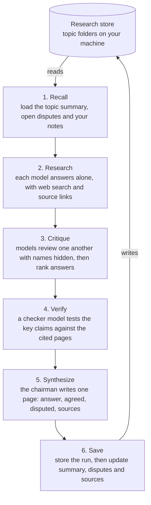

# Conclave

**An LLM council that remembers.** Several models research the same question, critique each other, and save what they conclude to a research store on your own machine. Every later question on that topic starts from what the council already worked out.

> **Status: milestone 1 of 8.** The project scaffold, configuration and research store setup work today. Asking questions arrives in milestone 2. See the [roadmap](#roadmap).

## Why this exists

If you use more than one AI assistant, you have probably asked the same question in several of them and then had to decide which answer to trust. Tools exist that run several models on one question, and tools exist that give models a shared memory. As of October 2026 I could not find one that does both: a debate whose conclusions are stored and fed into the next question.

| Capability | [Perplexity Model Council](https://www.perplexity.ai/help-center/en/articles/13641704-what-is-model-council) | [Karpathy's llm-council](https://github.com/karpathy/llm-council) | [OpenMemory](https://mem0.ai/openmemory) | Conclave (planned) |
| --- | --- | --- | --- | --- |
| Several models answer | Yes | Yes | No | Yes |
| Models critique each other | No, a synthesizer reads the answers | Yes | No | Yes |
| Live web research | Yes | No | No | Yes |
| Memory across sessions | None described | No | Yes | Yes |
| Data stored locally | No | Yes | Yes | Yes |
| Usable from Claude and Cursor | No | No | Yes, through MCP | Yes, through MCP |

This comparison is my reading of each project's public documentation on 6 October 2026. Corrections are welcome.

The gaps Conclave is built to close:

1. **Debate and memory are separate.** Council output is never saved as reusable knowledge.
2. **Real critique has no web access.** The one tool with cross-review debates from training data alone.
3. **Follow-ups start from zero.** Nothing loads your earlier research before answering.
4. **Disagreements are lost.** No tool tracks open disputes on a topic over time.
5. **Memory holds short notes, not research.** There is no notion of sources, confidence, or one conclusion replacing another.
6. **No claim checking.** Models can agree and still be wrong on the same weak evidence.

## How it works

A full run has six stages. The first and last are what connect the debate to the memory.



Every key claim on the final page carries a label: **verified**, **agreed but unchecked**, **single source**, or **disputed**. Agreement between models is never presented as proof.

More detail is in [docs/design.md](docs/design.md), and the reasoning behind each choice is in [docs/decisions](docs/decisions/).

## Install

Conclave needs Python 3.11 or newer.

```bash
git clone https://github.com/techtodpk/conclave.git
cd conclave
python -m pip install -e .
```

The [setup guide](docs/SETUP.md) has full steps for Windows, macOS and Linux, including a virtual environment, where files are kept, and troubleshooting.

## Quick start

```bash
conclave init      # creates ~/.conclave/config.toml and ~/conclave-research
conclave config    # shows the store, budget caps and every profile in effect
```

`conclave init --store /path/to/folder` puts the research store somewhere else. Running `init` again never overwrites anything.

## Choosing your council

The council is not fixed. A **profile** names the members who answer, the chairman who writes the final page, and the checker who verifies claims. Three profiles ship as a starting point, and you can edit them or add your own in `config.toml`.

| Profile | Members | Chairman | Use it for |
| --- | --- | --- | --- |
| `lean` | 3 models, two of them low-cost | mid-tier | everyday questions at lower cost |
| `balanced` (default) | 3 models from 3 vendors | mid-tier | most research |
| `full` | 4 models from 4 vendors | top-tier | decisions that matter |

Pick members from different vendors. Models from one lab tend to share blind spots, and `conclave config` warns when two members share a vendor.

Model ids in the default config are OpenRouter ids as listed in October 2026. They change, so check them against the [OpenRouter model list](https://openrouter.ai/models) before your first run.

## Cost

Conclave calls models through pay-per-use APIs. Subscriptions to chat apps generally do not cover API use, so this is a separate cost, and the design keeps it low.

- **One key.** An [OpenRouter](https://openrouter.ai/) key reaches every model. Credits are prepaid, so spending stops when the balance runs out.
- **Budget caps.** The config sets a cap per full run, per quick run and per month. A run that reaches its cap stops before the next stage and saves what it has.
- **Quick mode by default.** One model plus your store answers most questions. The full council runs when you ask for it.
- **Your own subscriptions, optionally.** From milestone 7, a member can be routed through a vendor's official command-line tool running on your own plan instead of the API. This is for personal use only, and you are responsible for checking your plan's terms.

Measured cost per run will be published here once milestone 2 produces real numbers.

## Privacy

- **Your research stays on your machine.** The store is a folder of plain files, and its search index is a local SQLite file. Conclave has no server.
- **Models see what they are asked about.** During a run, the recalled summary, disputes and notes for the topic are sent to the model providers as part of the prompt.
- **Backup is your choice.** The store reaches a Git remote only if you push it there.
- **Keys stay out of Git.** `.env` is ignored, and CI scans every push for secrets.

Keep your research store out of this repository. The `.gitignore` ignores `research/` and `conclave-research/` as a safety net.

## Roadmap

- [x] **1. Repo setup.** Licence, README, config, research store setup, tests and CI.
- [ ] **2. Council core.** Model client, profiles, a model picker with live prices, and the Research stage.
- [ ] **3. Critique and chairman.** Anonymised cross-review with saved rankings, then the one-page synthesis.
- [ ] **4. Store and recall.** Topic folders, summary and dispute updates, search, and a personal leaderboard.
- [ ] **5. Web search and claim check.** Search-enabled members, claim extraction, source fetch, verdicts.
- [ ] **6. MCP server.** Claude Desktop and Cursor read and write the same store.
- [ ] **7. CLI adapters and showcase.** Optional subscription routes, a sample topic, measured costs.
- [ ] **8. Public ranking chart.** Model rankings from published benchmarks beside your own leaderboard.

## Development

```bash
python -m pip install -e ".[dev]"
ruff check .
ruff format --check .
pytest
```

## Credits

The answer, critique and chairman pattern is inspired by Andrej Karpathy's [llm-council](https://github.com/karpathy/llm-council). Conclave's prompts and code are its own.

## Licence

[MIT](LICENSE)
