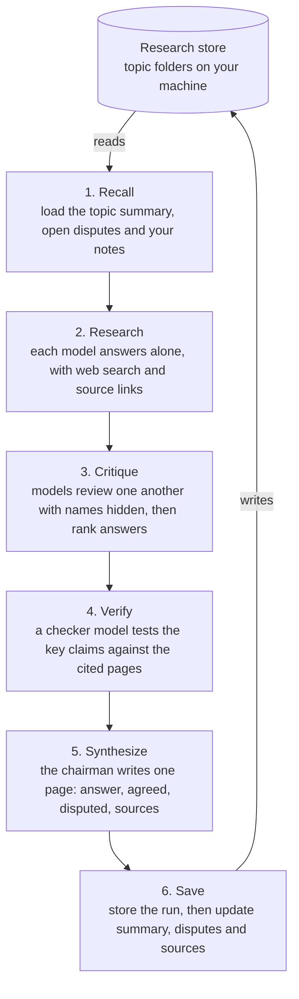

# Conclave

**An LLM council that remembers.** Several models research the same question, critique each other, and save what they conclude to a research store on your own machine. Every later question on that topic starts from what the council already worked out.

> **Status: milestone 2 of 8, version 0.2.0.** Conclave can ask one model or a whole council the same question and save every answer to your research store. It does not yet make the models critique each other, write a combined answer, remember earlier research, or search the web. See [what works today](#what-works-today), and [project status](docs/STATUS.md) for what is being built now and what is still to come.

## What works today

| Capability | Status | Arrives in |
| --- | --- | --- |
| Ask the chairman a question (quick mode) | Works | Milestone 2 |
| Ask every council member at the same time (`--full`) | Works | Milestone 2 |
| Save each run as plain files: question, one answer per model, tokens, cost and timings | Works | Milestone 2 |
| List models with live prices; build and pick council profiles | Works | Milestone 2 |
| Budget caps per run and per month, checked before anything is sent | Works | Milestone 2 |
| Models critique each other with names hidden, then rank the answers | Not yet | Milestone 3 |
| One-page combined answer showing what the models agreed and disagreed on | Not yet | Milestone 3 |
| Topic memory: earlier research is read before each new question | Not yet | Milestone 4 |
| Search across your past research; personal model leaderboard | Not yet | Milestone 4 |
| Web search, and checking key claims against the cited pages | Not yet | Milestone 5 |
| Use from Claude Desktop and Cursor (MCP server) | Not yet | Milestone 6 |
| Run members on your own Claude, Gemini or ChatGPT plan instead of the API | Not yet | Milestone 7 |
| Public benchmark ranking chart | Not yet | Milestone 8 |

**Until web search arrives, answers come from each model's training data.** Every answer lists its key claims with a confidence for each and says what it is unsure of, but nothing is checked against live sources yet.

Milestone 2 was run against the live OpenRouter API on Windows with Python 3.14 on 8 October 2026. The automated tests run in CI on Windows, macOS and Linux with every push.

## Why this exists

If you use more than one AI assistant, you have probably asked the same question in several of them and then had to decide which answer to trust. Tools exist that run several models on one question, and tools exist that give models a shared memory. As of October 2026 I could not find one that does both: a debate whose conclusions are stored and fed into the next question.

| Capability | [Perplexity Model Council](https://www.perplexity.ai/help-center/en/articles/13641704-what-is-model-council) | [Karpathy's llm-council](https://github.com/karpathy/llm-council) | [OpenMemory](https://mem0.ai/openmemory) | Conclave (planned) |
| --- | --- | --- | --- | --- |
| Several models answer | Yes | Yes | No | Yes |
| Models critique each other | No, a synthesizer reads the answers | Yes | No | Yes |
| Live web research | Yes | No | No | Yes |
| Memory across sessions | None described | No | Yes | Yes |
| Data stored locally | No | Yes | Yes | Yes |
| Usable from Claude and Cursor | No | No | Yes, through MCP | Yes, through MCP |

This comparison is my reading of each project's public documentation on 6 October 2026. Corrections are welcome.

The gaps Conclave is built to close:

1. **Debate and memory are separate.** Council output is never saved as reusable knowledge.
2. **Real critique has no web access.** The one tool with cross-review debates from training data alone.
3. **Follow-ups start from zero.** Nothing loads your earlier research before answering.
4. **Disagreements are lost.** No tool tracks open disputes on a topic over time.
5. **Memory holds short notes, not research.** There is no notion of sources, confidence, or one conclusion replacing another.
6. **No claim checking.** Models can agree and still be wrong on the same weak evidence.

## How it works

This is the design for a full run. Today only stage 2, Research, is built, without web search; the others arrive in milestones 3 to 5. The first and last stages are what connect the debate to the memory.



Every key claim on the final page carries a label: **verified**, **agreed but unchecked**, **single source**, or **disputed**. Agreement between models is never presented as proof.

More detail is in [docs/design.md](docs/design.md), and the reasoning behind each choice is in [docs/decisions](docs/decisions/).

## Install

Conclave needs Python 3.11 or newer.

```bash
git clone https://github.com/techtodpk/conclave.git
cd conclave
python -m pip install -e .
```

The [setup guide](docs/SETUP.md) has full steps for Windows, macOS and Linux, including a virtual environment, where files are kept, and troubleshooting.

## Quick start

```bash
conclave init      # creates ~/.conclave/config.toml and ~/conclave-research
conclave config    # shows the store, budget caps and every profile in effect
```

Add your [OpenRouter](https://openrouter.ai/keys) key (the [setup guide](docs/SETUP.md#6-add-your-api-key) says where), then ask:

```bash
conclave ask "Is Unity DOTS ready for production?"                  # quick: the chairman answers
conclave ask "Is Unity DOTS ready for production?" --full -t unity   # full: every member answers
```

Every run is saved as plain files under its topic in your research store:

```
conclave-research/topics/unity/runs/2026-10-07-143205-is-unity-dots-ready-for-production/
  question.md
  answers/anthropic--claude-sonnet-5.5.md
  answers/google--gemini-3.8-flash.md
  answers/openai--gpt-6.1-sol.md
  meta.json          models, tokens, cost and timings
```

`conclave init --store /path/to/folder` puts the research store somewhere else. Running `init` again never overwrites anything.

If your terminal says `conclave` is not recognised, run it through Python instead: `python -m conclave ask "..."` works the same way.

## Choosing your council

The council is not fixed. A **profile** names the members who answer, the chairman who writes the final page, and the checker who verifies claims. Three profiles ship as a starting point, and you can edit them or add your own in `config.toml`.

| Profile | Members | Chairman | Use it for |
| --- | --- | --- | --- |
| `lean` | 3 models, two of them low-cost | mid-tier | everyday questions at lower cost |
| `balanced` (default) | 3 models from 3 vendors | mid-tier | most research |
| `full` | 4 models from 4 vendors | top-tier | decisions that matter |

Pick members from different vendors. Models from one lab tend to share blind spots, and `conclave config` warns when two members share a vendor.

To see what is available and what it costs, then build your own council:

```bash
conclave models --search claude --sort price
conclave profile add mine \
  --members google/gemini-3.8-flash,deepseek/deepseek-v4.1-flash,openai/gpt-6.1-sol \
  --chairman anthropic/claude-opus-5.5
conclave ask "your question" --profile mine --full
```

`conclave ask --members a/model,b/model` asks a one-off set of models without saving a profile.

Model ids in the default config were checked against the [OpenRouter model list](https://openrouter.ai/models) on 7 October 2026. Ids change over time, and Conclave checks them against the live list before every run.

## Cost

Conclave calls models through pay-per-use APIs. Subscriptions to chat apps generally do not cover API use, so this is a separate cost, and the design keeps it low.

- **One key.** An [OpenRouter](https://openrouter.ai/) key reaches every model. Credits are prepaid, so spending stops when the balance runs out.
- **Budget caps.** The config sets a cap per full run, per quick run and per month. Before anything is sent, Conclave works out the most a run could cost and refuses it if that is above the cap.
- **Quick mode by default.** One model plus your store answers most questions. The full council runs when you ask for it.
- **Your own subscriptions, optionally.** From milestone 7, a member can be routed through a vendor's official command-line tool running on your own plan instead of the API. This is for personal use only, and you are responsible for checking your plan's terms.

Every run records its real cost in `meta.json` and prints it. First measured runs, 8 October 2026, one short technical question:

| Run | Models | Cost | Slowest answer |
| --- | --- | --- | --- |
| Quick | Claude Sonnet 5.5 as chairman | $0.012 | 10 s |
| Full, research stage only | Claude Sonnet 5.5, GPT-6.1 Sol, Gemini 3.8 Flash | $0.020 | 18 s |

These cover the Research stage alone. Full runs will cost more once critique, synthesis, claim checking and web search are added, and these figures will be updated as each milestone lands.

## Privacy

- **Your research stays on your machine.** The store is a folder of plain files. Conclave has no server.
- **Models see what they are asked.** Today that is your question. From milestone 4, the earlier research recalled for the topic is sent too, as part of the prompt.
- **Backup is your choice.** The store reaches a Git remote only if you push it there.
- **Keys stay out of Git.** The key is read from the environment or a `.env` file outside the code, is never printed or saved in a run, and CI scans every push for secrets.

Keep your research store out of this repository. The `.gitignore` ignores `research/` and `conclave-research/` as a safety net.

## Roadmap

The task-level plan for each milestone, with what is done, in progress and pending, is in [project status](docs/STATUS.md).

- [x] **1. Repo setup.** Licence, README, config, research store setup, tests and CI.
- [x] **2. Council core.** Model client, profiles, a model list with live prices, and the Research stage.
- [ ] **3. Critique and chairman.** Anonymised cross-review with saved rankings, then the one-page synthesis.
- [ ] **4. Store and recall.** Topic folders, summary and dispute updates, search, and a personal leaderboard.
- [ ] **5. Web search and claim check.** Search-enabled members, claim extraction, source fetch, verdicts.
- [ ] **6. MCP server.** Claude Desktop and Cursor read and write the same store.
- [ ] **7. CLI adapters and showcase.** Optional subscription routes, a sample topic, measured costs.
- [ ] **8. Public ranking chart.** Model rankings from published benchmarks beside your own leaderboard.

## Development

```bash
python -m pip install -e ".[dev]"
ruff check .
ruff format --check .
pytest
```

## Credits

The answer, critique and chairman pattern is inspired by Andrej Karpathy's [llm-council](https://github.com/karpathy/llm-council). Conclave's prompts and code are its own.

## Licence

[MIT](LICENSE)
