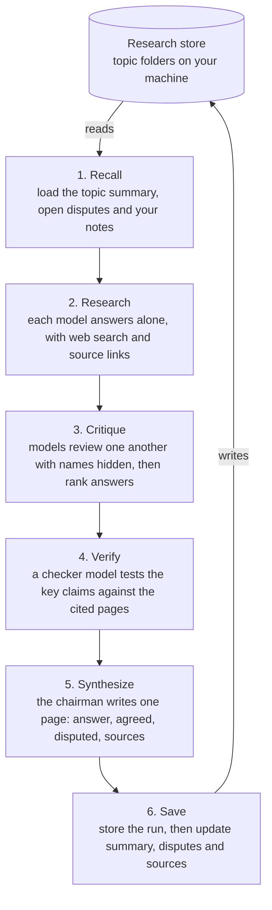

# Conclave

**Website: [techtodpk.github.io/conclave](https://techtodpk.github.io/conclave/)** · [Try it in your browser](https://codespaces.new/techtodpk/conclave?quickstart=1)

**An LLM council that remembers.** Several models research the same question, critique each other, and save what they conclude to a research store on your own machine. Every later question on that topic starts from what the council already worked out.

> **Status: milestone 7 of 9, version 0.7.0.** Conclave asks a council of AI models the same question. In a full run each member searches the web and cites its sources, the members review each other's answers with the authors hidden, a checker tests the key claims against the cited pages, and a chairman writes a one-page answer. It keeps a memory per topic, and every new question on a topic starts from what the council already concluded. It runs as an app in your browser, installed with one command, or from the command line; Claude Desktop and Cursor can use it too. See [what works today](#what-works-today), and [project status](docs/STATUS.md) for what is being built now.

## What works today

| Capability | Status | Arrives in |
| --- | --- | --- |
| An app in your browser: guided setup, live progress, topics, runs, search, spending and settings | Works | Milestone 7 |
| Install with one command, no Python or terminal skills needed | Works on Windows; macOS not yet tried | Milestone 7 |
| Ask the chairman a question (quick mode) | Works | Milestone 2 |
| Ask every council member at the same time (`--full`) | Works | Milestone 2 |
| Save each run as plain files: question, one answer per model, tokens, cost and timings | Works | Milestone 2 |
| List models with live prices; build and pick council profiles | Works | Milestone 2 |
| Budget caps per run and per month, checked before anything is sent | Works | Milestone 2 |
| Members review each other's answers with the authors hidden, and rank them | Works | Milestone 3 |
| Chairman's one-page answer, with every key claim labelled and the disagreements set out | Works | Milestone 3 |
| Topic memory: earlier conclusions, open disputes and your notes are read before each new question | Works | Milestone 4 |
| Memory updated after each full run under fixed rules, with every change shown; `--review` to approve first | Works | Milestone 4 |
| Search across your past research; list topics; personal model leaderboard | Works | Milestone 4 |
| Members search the web and cite sources; key claims checked against the cited pages | Works | Milestone 5 |
| Use from Claude Desktop and Cursor (MCP server) | Built; first live run pending | Milestone 6 |
| Run members on your own Claude, Gemini or ChatGPT plan instead of the API | Not yet | Milestone 8 |
| Public benchmark ranking chart | Not yet | Milestone 9 |

**"Verified" means a cited page states the claim, not that the claim is true.** Every key claim on the one-page answer carries a label, worked out in code from the evidence: verified, agreed but unchecked, single source, single model or disputed. `verification.md` shows the quote behind every verdict, so you can judge the page for yourself. Quick runs and `--no-search` runs answer from the models' training data and say so.

Milestone 2 was run against the live OpenRouter API on Windows with Python 3.14 on 8 October 2026. Milestone 3 was run against the live API the same day. Milestone 4 was run against the live API the same day: a second question on a topic started from what the first had concluded, and updated it. Milestone 5 was run against the live API the same day: it settled an open dispute from an earlier run against Python's own documentation. The automated tests run in CI on Windows, macOS and Linux with every push.

## Why this exists

If you use more than one AI assistant, you have probably asked the same question in several of them and then had to decide which answer to trust. Tools exist that run several models on one question, and tools exist that give models a shared memory. As of October 2026 I could not find one that does both: a debate whose conclusions are stored and fed into the next question.

| Capability | [Perplexity Model Council](https://www.perplexity.ai/help-center/en/articles/13641704-what-is-model-council) | [Karpathy's llm-council](https://github.com/karpathy/llm-council) | [OpenMemory](https://mem0.ai/openmemory) | Conclave (planned) |
| --- | --- | --- | --- | --- |
| Several models answer | Yes | Yes | No | Yes |
| Models critique each other | No, a synthesizer reads the answers | Yes | No | Yes |
| Live web research | Yes | No | No | Yes |
| Memory across sessions | None described | No | Yes | Yes |
| Data stored locally | No | Yes | Yes | Yes |
| Usable from Claude and Cursor | No | No | Yes, through MCP | Yes, through MCP |

This comparison is my reading of each project's public documentation on 6 October 2026. Corrections are welcome.

The gaps Conclave is built to close:

1. **Debate and memory are separate.** Council output is never saved as reusable knowledge.
2. **Real critique has no web access.** The one tool with cross-review debates from training data alone.
3. **Follow-ups start from zero.** Nothing loads your earlier research before answering.
4. **Disagreements are lost.** No tool tracks open disputes on a topic over time.
5. **Memory holds short notes, not research.** There is no notion of sources, confidence, or one conclusion replacing another.
6. **No claim checking.** Models can agree and still be wrong on the same weak evidence.

## How it works

This is a full run. Every stage is built. The first and last stages are what connect the debate to the memory.



Every key claim on the final page carries a label: **verified** (a cited page states it, and the checker quoted the words), **agreed but unchecked**, **single source** (every member leaned on one website), **single model**, or **disputed** (members disagree, or a page contradicts it). Agreement between models is never presented as proof.

More detail is in [docs/design.md](docs/design.md), and the reasoning behind each choice is in [docs/decisions](docs/decisions/).

## Install

**For everyone.** Copy one line into a terminal window, press Enter, and Conclave installs itself, puts a shortcut on your desktop and opens in your browser, where a short setup guides you through the rest. You need no Python, no Git and no administrator rights.

On **Windows**, open PowerShell (press the Windows key, type `powershell`, press Enter) and paste:

```powershell
powershell -ExecutionPolicy ByPass -c "irm https://raw.githubusercontent.com/techtodpk/conclave/main/install.ps1 | iex"
```

On **macOS**, open Terminal (press Cmd+Space, type `terminal`, press Enter); on **Linux**, open a terminal. Then paste:

```bash
curl -LsSf https://raw.githubusercontent.com/techtodpk/conclave/main/install.sh | sh
```

**Just want a look?** [Open Conclave in a GitHub Codespace](https://codespaces.new/techtodpk/conclave?quickstart=1): GitHub runs it on a cloud computer and it opens in your browser, using your own GitHub account's free monthly allowance. You still need an OpenRouter key to ask questions.

The setup in your browser asks where to keep your research, for your [OpenRouter](https://openrouter.ai/keys) key, which council to use and how much you are willing to spend, then lets you ask a first question. After that, open Conclave from its desktop shortcut. The [setup guide](docs/SETUP.md) shows each step, and how to update or remove Conclave.

**For developers.** Conclave needs Python 3.11 or newer.

```bash
git clone https://github.com/techtodpk/conclave.git
cd conclave
python -m pip install -e ".[app]"
conclave app
```

The [setup guide](docs/SETUP.md) also covers a virtual environment, the command line, and troubleshooting.

## Command line

Everything the app does can also be done from the command line.

```bash
conclave init      # creates ~/.conclave/config.toml and ~/conclave-research
conclave config    # shows the store, budget caps and every profile in effect
```

Add your [OpenRouter](https://openrouter.ai/keys) key (the [setup guide](docs/SETUP.md#6-add-your-api-key) says where), then ask:

```bash
conclave ask "Is Unity DOTS ready for production?"                  # quick: the chairman answers
conclave ask "Is Unity DOTS ready for production?" --full -t unity   # full: search, answer, review, check, sum up
```

Every run is saved as plain files under its topic in your research store, and each topic keeps a memory beside its runs:

```
conclave-research/topics/unity/
  summary.md         what the council has concluded, one claim per line, each with its label
  disputes.md        disagreements, open or resolved
  notes.md           your own notes; the council reads them first
  sources.md         every page the council cited, by run, and what it checked
  memory.json        the record the two files above are written from
  runs/2026-10-08-214739-is-unity-dots-ready-for-production/
    question.md
    recall.md        the earlier research the council was given
    answers/...      each member's answer
    critiques/...    each member's review of the others
    rankings.json    every member's ranking of the others
    sources.json     every page the members cited, and whether it could be fetched
    verification.md  each key claim checked, its verdict, the quote and its label
    final.md         the chairman's one-page answer, its sources, and what changed in memory
    memory_patch.json  the memory changes proposed, applied and refused
    meta.json        every call's model, tokens, cost and timing
```

Every question on a topic starts from what the council concluded before. Only full runs change the memory, and the rules are enforced in code, not left to the model: a claim enters only if it was verified or the members agreed on it, contested points become disputes, and nothing is deleted, only retired with a reason. `--review` shows the changes and asks before saving them; `--fresh` ignores the memory for one run; `--no-search` answers from the models' training data without searching.

```bash
conclave topics                                  # every topic, with runs, claims and disputes
conclave show unity                              # what the council has concluded on a topic
conclave note unity "We ship on low-end Android" # your own note; it outranks the council
conclave search "netcode"                        # search past answers, summaries and notes
conclave leaderboard                             # which models the others ranked highest
```

If the research store is a Git repository (`git init` inside it), every run and note is committed, so any change to the memory can be seen and undone.

A full run prints the one-page answer, then what each stage cost, how many searches each member ran, and how many key claims were verified. `--chairman <model id>` picks a different chairman for one run.

`conclave init --store /path/to/folder` puts the research store somewhere else. Running `init` again never overwrites anything.

To use the research store from Claude Desktop or Cursor, install the MCP extra and add Conclave to the client's config; [step 10 of the setup guide](docs/SETUP.md#10-use-conclave-from-claude-desktop-and-cursor) has the exact entry. The assistant can then list topics, search, read the council's conclusions, add a marked note, and ask the council a question: quick by default, full only when it asks, always within your caps.

If your terminal says `conclave` is not recognised, run it through Python instead: `python -m conclave ask "..."` works the same way.

## Choosing your council

The council is not fixed. A **profile** names the members who answer, the chairman who writes the final page, and the checker who verifies claims. Three profiles ship as a starting point, and you can edit them or add your own in `config.toml`.

| Profile | Members | Chairman | Use it for |
| --- | --- | --- | --- |
| `lean` | 3 models, two of them low-cost | mid-tier | everyday questions at lower cost |
| `balanced` (default) | 3 models from 3 vendors | mid-tier | most research |
| `full` | 4 models from 4 vendors | top-tier | decisions that matter |

Pick members from different vendors. Models from one lab tend to share blind spots, and `conclave config` warns when two members share a vendor.

To see what is available and what it costs, then build your own council:

```bash
conclave models --search claude --sort price
conclave profile add mine \
  --members google/gemini-3.8-flash,deepseek/deepseek-v4.1-flash,openai/gpt-6.1-sol \
  --chairman anthropic/claude-opus-5.5
conclave ask "your question" --profile mine --full
```

`conclave ask --members a/model,b/model` asks a one-off set of models without saving a profile.

Model ids in the default config were checked against the [OpenRouter model list](https://openrouter.ai/models) on 7 October 2026. Ids change over time, and Conclave checks them against the live list before every run.

## Cost

Conclave calls models through pay-per-use APIs. Subscriptions to chat apps generally do not cover API use, so this is a separate cost, and the design keeps it low.

- **One key.** An [OpenRouter](https://openrouter.ai/) key reaches every model. Credits are prepaid, so spending stops when the balance runs out.
- **Budget caps.** The config sets a cap per full run, per quick run and per month. Before anything is sent, Conclave works out the most a run could cost and refuses it if that is above the cap.
- **Quick mode by default.** One model plus your store answers most questions. The full council runs when you ask for it.
- **Search within limits.** In a full run each member may search up to 3 times (about $0.007 per search), and `--no-search` turns it off.
- **Your own subscriptions, optionally.** From milestone 8, a member can be routed through a vendor's official command-line tool running on your own plan instead of the API. This is for personal use only, and you are responsible for checking your plan's terms.

Every run records its real cost in `meta.json` and prints it. First measured runs, 8 October 2026, one short technical question:

| Run | Models | Cost | Slowest answer |
| --- | --- | --- | --- |
| Quick | Claude Sonnet 5.5 as chairman | $0.012 | 10 s |
| Full, research stage only (milestone 2) | Claude Sonnet 5.5, GPT-6.1 Sol, Gemini 3.8 Flash | $0.020 | 18 s |
| Full: research, critique and synthesis (milestone 3) | Same three members, Claude Sonnet 5.5 as chairman | $0.066 | about 42 s in total |
| Full, with recall and memory update (milestone 4) | Same council, on a topic with 6 stored claims | $0.090 | about 55 s in total |
| Full, with web search and claim checks (milestone 5) | Two of the three members answered; 11 pages cited, 8 claims checked | $0.171 | about 80 s in total |
| Full, with web search and claim checks, after fixes | All three members; 8 searches, 17 pages cited, 8 claims checked | $0.285 | about 100 s in total |

The first full run cost $0.066, about 9% of its $0.75 cap. The chairman's page was the largest single cost ($0.021), because it reads every answer and review. Since milestone 5 a full run also searches the web and makes two claim-checking calls. The pre-run ceiling for the `balanced` profile is about $0.59, assuming every member uses every search and every call writes as much as it may, and the default full-run cap is $1.00. Measured runs with search cost $0.17 and $0.28, including OpenRouter's search fees. The research stage is now the largest cost, because each member reads its search results.

## Privacy

- **Your research stays on your machine.** The store is a folder of plain files. Conclave has no server of its own: the app runs on your computer and answers only to pages from your computer.
- **Models see what they are asked.** That is your question plus the topic's recalled memory: its claims, open disputes and your notes. `--fresh` sends the question alone.
- **Searches go through OpenRouter.** In a full run, the search queries the members write go to OpenRouter and its search provider, Exa. Pages cited for claim checking are fetched directly from your machine. Neither sees your research store. `--no-search` turns both off.
- **Backup is your choice.** The store reaches a Git remote only if you push it there.
- **MCP clients see only your research store.** The MCP server offers tools that read the store, add a note marked as the assistant's, and run a question within your caps. It never returns your API key.
- **Keys stay out of Git.** The key is read from the environment or a `.env` file outside the code, is never printed or saved in a run, and CI scans every push for secrets.

Keep your research store out of this repository. The `.gitignore` ignores `research/` and `conclave-research/` as a safety net.

## Roadmap

The task-level plan for each milestone, with what is done, in progress and pending, is in [project status](docs/STATUS.md).

- [x] **1. Repo setup.** Licence, README, config, research store setup, tests and CI.
- [x] **2. Council core.** Model client, profiles, a model list with live prices, and the Research stage.
- [x] **3. Critique and chairman.** Anonymised cross-review with saved rankings, then the one-page synthesis.
- [x] **4. Store and recall.** Topic memory read before every question and updated after full runs, search, and a personal leaderboard.
- [x] **5. Web search and claim check.** Search-enabled members, claim extraction, source fetch, verdicts.
- [ ] **6. MCP server.** Claude Desktop and Cursor read and write the same store. Built; live run pending.
- [x] **7. App and guided install.** A local app in the browser and a one-command install, for people who do not use a terminal.
- [ ] **8. CLI adapters and showcase.** Optional subscription routes, a sample topic, measured costs.
- [ ] **9. Public ranking chart.** Model rankings from published benchmarks beside your own leaderboard.

## Development

```bash
python -m pip install -e ".[dev]"   # includes the app and MCP extras, so their tests run
ruff check .
ruff format --check .
pytest
```

## Credits

The answer, critique and chairman pattern is inspired by Andrej Karpathy's [llm-council](https://github.com/karpathy/llm-council). Conclave's prompts and code are its own.

## Licence

[MIT](LICENSE)
