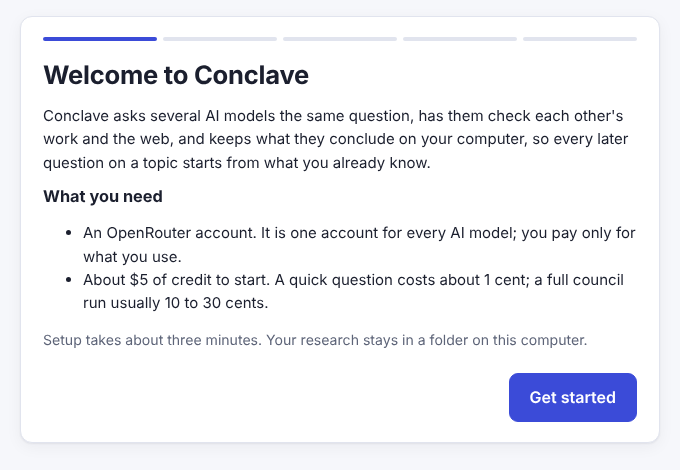
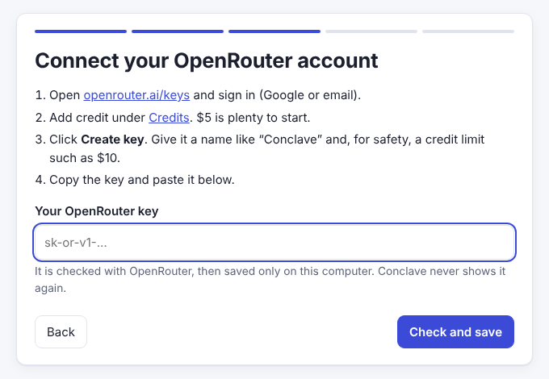
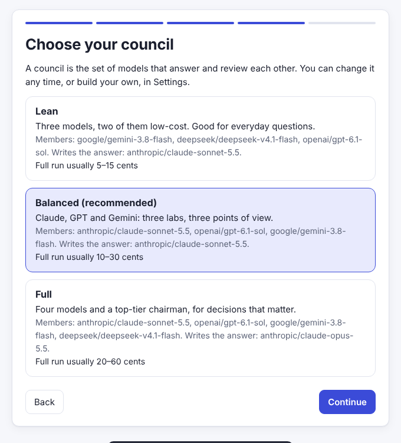
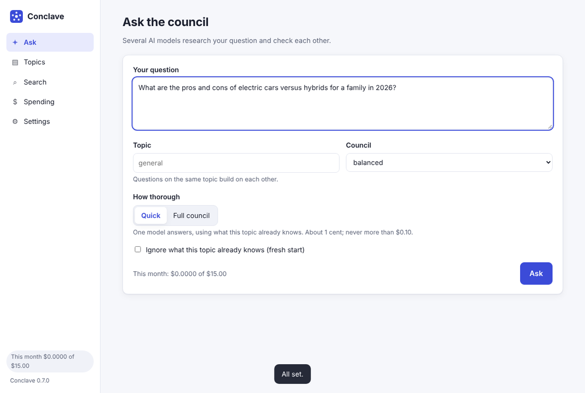
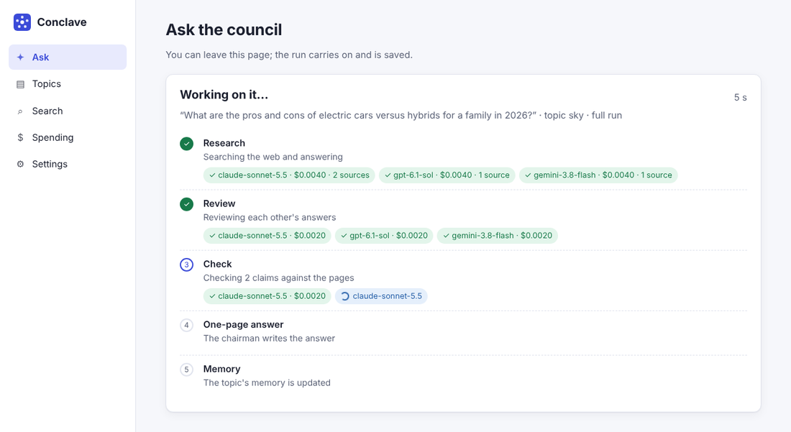
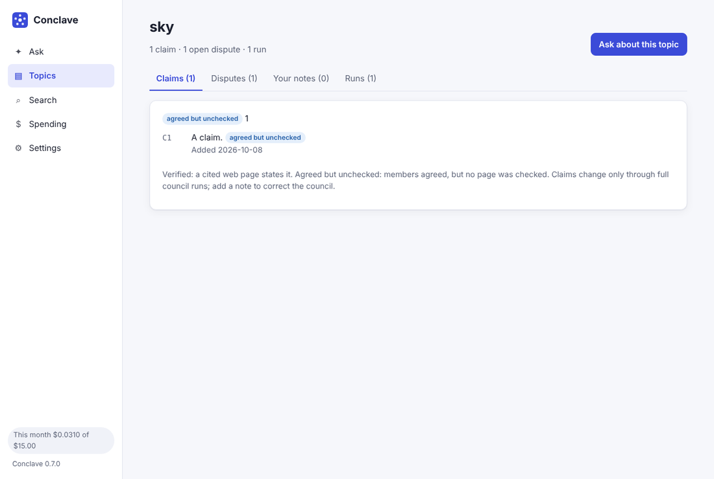

# Setting up Conclave on your machine

This guide takes you from nothing to asking your first question, on Windows, macOS or Linux. The README's [what works today](../README.md#what-works-today) table lists every capability.

There are two ways in:

- **[Install the app](#install-the-app)**, if you do not write code. One copied command installs everything, and a setup in your browser does the rest.
- **[Steps 1 to 15](#1-what-you-need)**, if you want the source code, the command line, or to change Conclave yourself.

## Install the app

**To try it without installing,** [open it in a GitHub Codespace](https://codespaces.new/techtodpk/conclave?quickstart=1): GitHub runs Conclave on a cloud computer and opens it in your browser, from your own GitHub account's free monthly allowance. Everything below is for installing it on your own computer, where your research stays.

You need an internet connection and about five minutes. You do not need Python, Git or administrator rights; the installer gets what it needs and keeps it in your own user folder.

### 1. Open a terminal window

- **Windows:** press the Windows key, type `powershell`, and press Enter. A blue or black window opens.
- **macOS:** press Cmd+Space, type `terminal`, and press Enter.
- **Linux:** open your terminal app.

### 2. Paste the install command and press Enter

**Windows:**

```powershell
powershell -ExecutionPolicy ByPass -c "irm https://raw.githubusercontent.com/techtodpk/conclave/main/install.ps1 | iex"
```

**macOS and Linux:**

```bash
curl -LsSf https://raw.githubusercontent.com/techtodpk/conclave/main/install.sh | sh
```

The installer shows three steps: it gets uv (a small tool that keeps a private copy of Python just for Conclave), installs Conclave, and puts a **Conclave** shortcut on your desktop. The first time this takes one or two minutes. Then Conclave opens in your browser.

`-ExecutionPolicy ByPass` lets PowerShell run this one installer without changing your computer's settings. You can read the installer first: [install.ps1](../install.ps1) and [install.sh](../install.sh).

### 3. Follow the setup in your browser



The setup has five short steps:

1. **Welcome.** What Conclave does and what it costs.
2. **Research folder.** Where your questions and answers are kept. The default is a `conclave-research` folder in your home folder.
3. **OpenRouter key.** OpenRouter is one account that reaches every AI model; you pay only for what you use. The screen walks you through it: sign in at [openrouter.ai/keys](https://openrouter.ai/keys), add about $5 of credit, create a key with a credit limit such as $10, and paste it in. Conclave checks the key with OpenRouter before saving it, and keeps it only on your computer.

   

4. **Council.** Which models answer. *Balanced* (Claude, GPT and Gemini) is a good start. You can build your own later.

   

5. **Spending limits.** The most one question and one month may cost. Conclave works out the most a question could cost before sending anything, and refuses it if that is over your limit.

### 4. Ask a question



Type a question and give it a **topic**: questions on the same topic build on each other. Choose **Quick** (one model, about 1 cent) or **Full council** (every member searches the web, they review each other, key claims are checked against the web pages they cite, and one page sums it up; usually 10 to 30 cents, one to two minutes).

You can watch each stage as it happens:



When it finishes you get the one-page answer. Every key claim carries a label: **verified** means a cited web page states it; **agreed but unchecked** means the members agreed but no page was checked; **single source**, **single model** and **disputed** are weaker.

The other pages:

| Page | What it shows |
| --- | --- |
| Topics | What the council has concluded on each topic, open disagreements, your own notes, and every past run |
| Search | Everything the council has written, and your notes |
| Spending | This month's total against your limit, every run's cost, and which models the others rank highest |
| Settings | Your key, default council, spending limits, web search, and councils you build from OpenRouter's model list with live prices |



### 5. Next time

Open Conclave from the **Conclave** shortcut on your desktop (on Windows, also in the Start menu). A small window opens beside your browser: keep it open while you use Conclave, and close it to stop Conclave. Opening the shortcut again while Conclave is running just brings the page back.

### Update or remove the app

- **Update:** run the same install command again. Your research, settings and key are kept.
- **Remove:** run `uv tool uninstall conclave-council` in a terminal, and delete the Conclave shortcut. Your research folder and your settings (in the `.conclave` folder in your home folder) are left untouched; delete them yourself if you want them gone.

### If the installer has a problem

| Problem | Fix |
| --- | --- |
| Windows says scripts are disabled | Copy the whole command, including `powershell -ExecutionPolicy ByPass -c` at the start |
| `uv could not be installed` | Check your internet connection. On a work computer, a firewall may block downloads from astral.sh or github.com |
| The browser did not open | Open the Conclave shortcut, or go to http://127.0.0.1:8765 yourself |
| `This app only answers requests addressed to this computer` | Use the address `http://127.0.0.1:8765`, not your computer's network name |
| No shortcut on the desktop | Open a new terminal and run `conclave shortcut`. Or start Conclave with `conclave app` |
| Something else | Run `conclave app` in a terminal and copy what it prints into an issue on GitHub. Remove your key from anything you paste |

---

The steps below are for developers and command-line users.

## 1. What you need

| Requirement | Version | Check it with | Get it from |
| --- | --- | --- | --- |
| Python | 3.11 or newer | `python --version` (Windows: `py --version`) | [python.org/downloads](https://www.python.org/downloads/) |
| Git | any recent version | `git --version` | [git-scm.com/downloads](https://git-scm.com/downloads) |
| OpenRouter account with credit | | | [openrouter.ai](https://openrouter.ai/) |

On Windows, tick **"Add python.exe to PATH"** in the Python installer.

The OpenRouter account is only needed for asking questions. Installing, `conclave init`, `conclave config` and `conclave models` all work without it.

## 2. Get the code

```bash
git clone https://github.com/techtodpk/conclave.git
cd conclave
```

## 3. Create a virtual environment

A virtual environment keeps Conclave's packages separate from the rest of your system. It is optional but recommended.

**Windows (PowerShell)**

```powershell
py -m venv .venv
.venv\Scripts\Activate.ps1
```

**macOS and Linux**

```bash
python3 -m venv .venv
source .venv/bin/activate
```

Your prompt now starts with `(.venv)`. You need to activate the environment again in every new terminal window before using `conclave`.

## 4. Install Conclave

```bash
python -m pip install -e ".[app]"
```

`.[app]` adds the browser app; plain `.` installs the command line alone.

The `-e` installs it in editable mode, so changes you make to the code take effect without reinstalling.

Check that it worked:

```bash
conclave --version
```

If the terminal says `conclave` is not recognised, use `python -m conclave --version` instead. Every command in this guide works the same way with `python -m conclave` in place of `conclave`.

Expected output:

```
conclave 0.7.0
```

## 5. First run

```bash
conclave init
```

Expected output, with your own home folder in the paths:

```
Created config: /home/you/.conclave/config.toml
Created research store: /home/you/conclave-research

Next: run `conclave config` to check the settings in effect.
```

Then:

```bash
conclave config
```

This prints the config file in use, the research store location, the three budget caps, and every profile with its members, chairman and checker.

`conclave init` is safe to run again. It never overwrites an existing config file or anything in an existing store.

## 6. Add your API key

Conclave calls models through [OpenRouter](https://openrouter.ai/), which gives one key for models from many vendors.

1. Create an OpenRouter account.
2. Buy a small amount of prepaid credit. Leave auto top-up **off** if you want a hard ceiling on spending.
3. Create an API key at [openrouter.ai/keys](https://openrouter.ai/keys).
4. Put the key in a file named `.env` in your `.conclave` folder, which `conclave init` created. Open the file in an editor:

   **Windows (PowerShell)**

   ```powershell
   notepad "$HOME\.conclave\.env"
   ```

   **macOS and Linux**

   ```bash
   nano ~/.conclave/.env
   ```

5. Type this one line, with your real key after the `=`, then save:

   ```
   OPENROUTER_API_KEY=sk-or-v1-your-key-here
   ```

Using an editor keeps the key out of your terminal history.

Conclave looks for the key in three places, in this order: the `OPENROUTER_API_KEY` environment variable, a `.env` file in the folder you run `conclave` from, and the `.env` file in your `.conclave` folder.

Never paste a key into the config file, an issue, or a commit. Conclave never prints or stores the key.

## 7. Ask your first question

Start with a quick run, which asks one model (the chairman of the default profile):

```bash
conclave ask "What is the difference between a process and a thread?"
```

The answer is printed, followed by a summary like this:

```
---
Asked the chairman (profile 'balanced', topic 'general')

  anthropic/claude-sonnet-5.5  ok     312 in     588 out  $0.0065  9.4s

Cost: $0.0065 of the $0.10 cap for quick runs. This month: $0.0065 of $15.00.
Saved to: /home/you/conclave-research/topics/general/runs/2026-10-07-143205-what-is-the-difference-between-a-process-and
```

Your token counts, cost and time will differ.

Then a full run, filed under a topic:

```bash
conclave ask "What is the difference between a process and a thread?" --full --topic operating-systems
```

A full run has four stages:

1. **Research.** Every member of the profile answers on its own, at the same time. Each may search the web up to 3 times and cites the pages it used.
2. **Critique.** Each member reviews the other answers, which are labelled A, B, C so the reviewer does not know who wrote them, and ranks them.
3. **Verify.** The profile's checker picks up to 8 key claims. Conclave fetches the pages cited for them, from your machine, and the checker says whether each page supports, contradicts or does not settle the claim, quoting the words that decide it. A verdict counts only if the quote is really in the page.
4. **Synthesis.** The chairman reads the answers, reviews and checks and writes a one-page answer. Each key claim is labelled "verified", "agreed but unchecked", "single source", "single model" or "disputed", and the disagreements are set out.

Add `--no-search` to skip searching and checking and answer from the models' training data alone.

The one-page answer is printed, followed by what each stage cost. Open the folder named after "Saved to". You should find:

| File | What it holds |
| --- | --- |
| `final.md` | The one-page answer and its sources, ending with which model wrote which response and how the others ranked it |
| `verification.md` | Each key claim the checker tested: the pages, the verdict, the quoted words and the label. `verification.json` holds the same |
| `sources.json` | Every page the members cited, who cited it, and whether Conclave could fetch it |
| `question.md` | The question, the time, the topic, the mode and the profile |
| `answers/<vendor>--<model>.md` | Each member's own answer, with its response letter |
| `critiques/<vendor>--<model>.md` | Each member's review of the others |
| `rankings.json` | Every member's ranking of the others, and the average position of each answer |
| `meta.json` | Every call's model, tokens, cost and time, plus the run total |

A quick run saves only `question.md`, the chairman's answer and `meta.json`.

To try a different chairman for one run, add `--chairman <model id>`.

**What it costs.** With the default settings and prices as listed on 8 October 2026, a quick run costs at most about 4 cents and a full run with the `balanced` profile at most about 59 cents, if every member uses every search and every call writes as much as it may. Measured full runs without search cost about 7 to 10 cents. Before anything is sent, Conclave works out the most the run could cost and refuses it if that is above the cap in your config. Most runs cost well under that ceiling, because models rarely use the full answer length.

Before each later stage, Conclave checks again: if that stage could take the run over its cap, it stops and keeps everything up to that point.

If one member fails, for example because its provider is busy, the others carry on and the failure is shown. If only one member answers, there is nothing to compare, so the review and the one-page answer are skipped. If the chairman fails, the answers and reviews are still saved. If no model answers, nothing is saved.

## 8. Build up a topic's memory

Each topic keeps a memory of what the council concluded, and `sources.md`, a list of every page it cited. Ask a second, related question on the same topic and the council starts from the first one:

```bash
conclave ask "What is the difference between a process and a thread?" --full --topic operating-systems
conclave ask "When should I use processes instead of threads?" --full --topic operating-systems
```

The second run prints `Memory: recalled ...` near the end, and its `final.md` ends with "What changed in memory". Then look at the topic:

```bash
conclave topics                       # every topic, with runs, claims and open disputes
conclave show operating-systems       # the claims, open disputes, your notes and recent runs
```

Add your own knowledge with a note. Notes are read first and take precedence over the council's conclusions:

```bash
conclave note operating-systems "Our services run on Linux containers, 2 vCPUs each."
```

Other useful commands:

| Command | What it does |
| --- | --- |
| `conclave search "context switch"` | Searches every question, answer, final page, summary and note |
| `conclave leaderboard` | Which models the others ranked highest across your full runs |
| `conclave ask "..." --full --review` | Shows the proposed memory changes and asks before saving them |
| `conclave ask "..." --fresh` | Ignores the topic's memory for one run and leaves it unchanged |

How the memory is kept honest:

- Only full runs change it; quick runs read it.
- A claim enters only if the checker verified it against a source or the members agreed on it. Points only one model made, or that every member took from one website, are not stored, and contested points become disputes.
- A claim is stored as "verified" only if it matches a claim the checker verified in that run.
- Nothing is deleted. A claim that turns out wrong is retired with a reason and stays visible in `summary.md`.
- Do not edit `summary.md` or `disputes.md` by hand: they are rewritten from `memory.json` after every full run. Use a note instead.

**Keep a history of the memory with Git (optional).** Make the research store a Git repository and every run and note is committed automatically, so you can see and undo any change:

```bash
cd ~/conclave-research
git init
```

On Windows PowerShell the folder is `$HOME\conclave-research`. Keep this repository private; it holds your research.

## 9. Choose your council

List the models you can use, with live prices:

```bash
conclave models                          # the first 30, alphabetical
conclave models --search gemini          # by name
conclave models --vendor anthropic --sort price
```

Build a profile of your own from model ids in that list:

```bash
conclave profile add mine --members google/gemini-3.8-flash,deepseek/deepseek-v4.1-flash,openai/gpt-6.1-sol --chairman anthropic/claude-opus-5.5
conclave ask "your question" --profile mine --full
```

Conclave checks every id against the live list before adding the profile, and warns if two members come from the same vendor. Models from one lab tend to share blind spots, so a spread of vendors makes a better council.

To try a set of models once without saving a profile:

```bash
conclave ask "your question" --members google/gemini-3.8-flash,openai/gpt-6.1-sol
```

## 10. Use Conclave from Claude Desktop and Cursor

Conclave can run as an MCP server, so Claude Desktop, Cursor and other MCP clients can search your research store, read what the council concluded, and ask the council a question in the middle of a conversation.

**If you installed the app** with the one-line command, the MCP part is already installed. Find the `conclave` command with `where.exe conclave` on Windows or `which conclave` on macOS and Linux; it prints something like `C:\Users\you\.local\bin\conclave.exe`. Use that path as `command` and `["mcp"]` as `args` in step 3 below, and skip steps 1 and 2:

```json
{
  "mcpServers": {
    "conclave": {
      "command": "C:\\Users\\you\\.local\\bin\\conclave.exe",
      "args": ["mcp"]
    }
  }
}
```

**If you installed from the code:**

**1. Install the MCP extra**, from the Conclave folder:

```bash
python -m pip install -e ".[mcp]"
```

**2. Find the full path to your Python.** MCP clients do not see your terminal's PATH or virtual environment, so give them the exact Python that has Conclave installed:

```bash
python -c "import sys; print(sys.executable)"
```

On Windows this prints something like `C:\Users\you\AppData\Local\Python\pythoncore-3.14-64\python.exe`; with a virtual environment, something like `D:\code\conclave\.venv\Scripts\python.exe`.

**3. Add Conclave to the client's config.** The entry is the same for both clients; only the file differs. Put your own Python path in `command`, writing each `\` in a Windows path as `\\`:

```json
{
  "mcpServers": {
    "conclave": {
      "command": "C:\\Users\\you\\AppData\\Local\\Python\\pythoncore-3.14-64\\python.exe",
      "args": ["-m", "conclave", "mcp"]
    }
  }
}
```

| Client | Config file |
| --- | --- |
| Claude Desktop | Settings, then Developer, then Edit Config. The file is `%APPDATA%\Claude\claude_desktop_config.json` on Windows and `~/Library/Application Support/Claude/claude_desktop_config.json` on macOS |
| Cursor | `%USERPROFILE%\.cursor\mcp.json` on Windows and `~/.cursor/mcp.json` on macOS and Linux, for every project; or `.cursor/mcp.json` inside one project |

If the file already has an `mcpServers` section, add only the `"conclave": {...}` entry inside it, with a comma after the entry before it; a second `mcpServers` block makes the whole file invalid. Copy the file before editing it. If your config file is not in the default place, add `"--config", "<path to config.toml>"` to `args`.

**4. Restart the client completely.** For Claude Desktop, quit it from the system tray icon, not just the window. In Claude Desktop, Conclave then appears under Connectors; in Cursor, under Settings, then Tools & MCP.

**5. Try it.** Ask the assistant something like "What has my Conclave research concluded about processes and threads?" It should list your topics and read the `os` topic before answering.

The server offers six tools:

| Tool | What it does | Costs money |
| --- | --- | --- |
| `list_topics` | Every topic, with runs, claims and open disputes | No |
| `search_research` | Full-text search of past questions, answers, summaries and notes | No |
| `get_topic` | A topic's claims with their labels, open disputes, your notes and recent runs | No |
| `get_run` | The saved one-page answer of a run, the latest by default | No |
| `ask_council` | Runs a question. Quick by default; a full council run only when the assistant asks for it | Yes, within your caps |
| `add_note` | Adds a note to a topic, marked as added by the assistant | No |

Your budget caps apply to every `ask_council` call exactly as in the terminal, including the monthly cap. A full run takes one to two minutes, so the assistant waits for it. Notes an assistant adds end with the name the client gives itself, such as "(added by claude-ai via MCP)" from Claude Desktop, so you can tell them from your own and remove any you disagree with in `notes.md`.

If the server does not appear, check the client's logs. Claude Desktop keeps them in `%APPDATA%\Claude\logs` on Windows and `~/Library/Logs/Claude` on macOS, in a file named `mcp-server-conclave.log`. The most common causes are a wrong Python path, the MCP extra not installed, and a JSON syntax error such as a single `\` in a Windows path.

## 11. Where your files are kept

| What | Default location | How to change it |
| --- | --- | --- |
| Config file | `~/.conclave/config.toml` | `--config <file>` on any command, or the `CONCLAVE_CONFIG` environment variable |
| API key | `~/.conclave/.env` | See step 6 for the other places it can live |
| Research store | `~/conclave-research` | `conclave init --store <folder>` the first time, or edit `path` under `[store]` in the config file |

`~` is your home folder: `C:\Users\<you>` on Windows, `/Users/<you>` on macOS, `/home/<you>` on Linux.

To put the research store somewhere else from the start:

```bash
conclave init --store /path/to/my-research
```

Keep the research store **outside** the Conclave code folder. Your research is private; the code repository is public.

**What leaves your machine.** The store and everything in it stay on your disk. When you ask a question, the question and the topic's recalled memory (its claims, open disputes and your notes) are sent to OpenRouter and on to the model vendors you chose. In a full run, the search queries the members write go to OpenRouter's search provider, Exa, and the pages cited for claim checking are fetched directly from your machine, like opening them in a browser. Nothing else is sent. Use `--fresh` to leave out the memory, and `--no-search` to turn off searching and fetching.

## 12. Change the settings

Open the config file in any text editor. It is commented throughout. The parts you are most likely to change:

- **`[budget]`**: the spending caps per full run, per quick run and per month, in US dollars.
- **`[run]`**: which profile and which mode are used when you do not say, `max_answer_tokens`, the longest answer a model may give (lower it to cut cost), and `reasoning`, how hard reasoning models think before answering (`none`, `minimal`, `low`, `medium` or `high`; default `low`). Thinking is billed as output, and every call gets 2,048 tokens of room for it on top of the answer.
- **`[search]`**: `enabled` turns web search and claim checking on or off for full runs, and `max_searches` is the most searches one member may run for one answer (default 3, about $0.007 each).
- **`[profiles.<name>]`**: who sits on the council, the chairman, and the checker who tests claims against sources.

After editing, run `conclave config`. It either shows the new settings or tells you exactly which value is wrong.

## 13. Run the tests

To check that the code works on your machine, install the development tools and run the three checks that CI runs:

```bash
python -m pip install -e ".[dev]"
ruff check .
ruff format --check .
pytest
```

All tests should pass. They use a simulated OpenRouter, so they need no key, cost nothing and work offline.

## 14. Troubleshooting

| Problem | Likely cause | Fix |
| --- | --- | --- |
| `conclave`, `pytest` or `ruff` is not recognised, or "command not found" | The virtual environment is not active in this terminal, or you installed without one | Activate it again (step 3). Or run the tools through Python, which always works: `python -m conclave`, `python -m pytest`, `python -m ruff` |
| PowerShell says running scripts is disabled when you activate | PowerShell's execution policy blocks `Activate.ps1` | Use Command Prompt and run `.venv\Scripts\activate.bat` instead, or skip activation and use the full path above |
| `python` is not recognised on Windows | Python is not on PATH | Use `py` instead of `python`, or reinstall Python with "Add python.exe to PATH" ticked |
| pip reports that the package requires a different Python | Your Python is older than 3.11 | Install Python 3.11 or newer and create the virtual environment again with it |
| `No OpenRouter API key found` | The key is not in any of the three places Conclave looks, or the file was not saved | The message lists each file it checked and what it found there. In Notepad, save with Ctrl+S before running `conclave` again; PowerShell does not wait for Notepad to close. If it says `.env.txt is there`, rename that file to `.env` |
| `OpenRouter rejected the API key` | The key is mistyped, revoked, or has spaces around it | Create a new key and replace the line in `.env` |
| `The OpenRouter account is out of credit` | The prepaid balance is used up | Add credit at openrouter.ai |
| `'<id>' is not in OpenRouter's model list` | A model was renamed or retired, or the id is mistyped | Run `conclave models --search <name>` and put the current id in your profile |
| `This run could cost up to ...` | The worst-case cost is above your cap | Lower `max_answer_tokens`, choose cheaper models, or raise the cap in `[budget]` |
| `full runs are paused` | This month's recorded spending reached the monthly cap | Raise `monthly_usd` in `[budget]`. Quick runs still work |
| `Rate limited` on one member | That model's provider is busy | Run again shortly. The other members' answers were saved |
| `CUT OFF` beside a model, or `Cut off at the length limit` | The model reached its length limit, so that text ends early. The other models are told | Raise `max_answer_tokens`, or set `reasoning` lower in `[run]` |
| `No member cited a web page` | The members answered without searching, or cited nothing | Nothing to fix; the claims are labelled from the members' agreement. A question about recent facts is more likely to make them search |
| A source shows `no (HTTP 403)`, `not a web page` or `needs JavaScript` in `sources.md` | The site blocked the download, the link is a PDF, or the page builds its text in the browser | The checker used the search excerpt instead, and `verification.md` says so. Open the link yourself to judge it |
| A verdict says `its quote is not in the source, so the verdict was not accepted` | The checker paraphrased instead of quoting the page word for word | Nothing to fix; the claim is counted as not found, which is the safe side. If it happens often with one checker model, choose another in the profile |
| `Claim checking was skipped` | Checking could have taken the run over its cap | Raise `full_run_usd` in `[budget]`, or lower `claims_checked` in `[run]` |
| `Stopped before the critique stage` (or synthesis) | That stage could have taken the run over its cap | The earlier stages are saved. Raise `full_run_usd` in `[budget]`, or lower `max_answer_tokens` |
| A review's ranking `left out rather than guessed` | The model did not write its ranking in the expected form | Nothing to fix; that one ranking is left out of the averages. If it happens often with one model, choose another |
| `... memory.json could not be read` | The topic's memory file was damaged, for example by a hand edit | Restore it from the store's Git history, or move it aside to start that topic's memory again. The runs are not affected |
| A note or claim you expected is missing from the answer | The recalled memory is cut at about 12,000 characters | `conclave show <topic>` lists everything kept. Split a large topic into narrower ones |
| `The MCP server needs the optional MCP package` | `conclave mcp` was started without the MCP extra | Run `python -m pip install -e ".[mcp]"` with the same Python your MCP client starts, then restart the client |
| Conclave does not appear in Claude Desktop or Cursor | Wrong Python path, MCP extra missing, or invalid JSON in the client's config | Check step 10. Run the `command` and `args` from the config in a terminal yourself: it should wait silently for input (stop it with Ctrl+C) |
| `Config problem: ...` | A value in the config file is invalid | The message names the setting and what it must be. Fix that line and run `conclave config` again |
| You want to start over with the default config | | Rename or delete the config file, then run `conclave init`. Your research store is not touched |

If something else goes wrong, open an issue with the command you ran, the full output, your operating system and your Python version. Remove your API key from anything you paste.

## 15. Update or remove

**Update to the latest code**

```bash
git pull
python -m pip install -e .
```

**Remove Conclave**

```bash
python -m pip uninstall conclave-council
```

Then delete the `conclave` code folder and, if you no longer want your settings and key, the `.conclave` folder in your home folder.

Your research store is a normal folder of plain text files and is never deleted by Conclave. Remove it yourself only if you no longer want the research in it.
